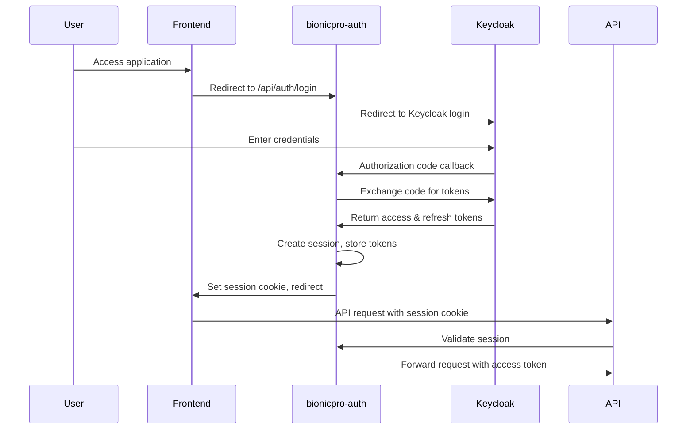

# BionicPRO Authentication System

## Overview

This document describes the authentication system implemented in the bionicpro-auth service. The system provides secure authentication using Keycloak as the identity provider, with session management and token handling on the backend.

## Architecture

The authentication flow follows these steps:

1. User accesses the frontend application
2. Frontend redirects to bionicpro-auth service for authentication
3. bionicpro-auth service redirects to Keycloak for user authentication
4. Keycloak authenticates user and redirects back to bionicpro-auth with authorization code
5. bionicpro-auth exchanges authorization code for access and refresh tokens
6. bionicpro-auth creates a session and stores tokens securely
7. bionicpro-auth sets a session cookie and redirects user back to frontend
8. Frontend makes API requests with session cookie
9. bionicpro-auth validates session and attaches appropriate tokens to requests

## Components

### SessionService

Manages user sessions including:
- Creating sessions after successful authentication
- Validating sessions on each request
- Refreshing access tokens when they expire
- Rotating sessions to prevent session fixation attacks
- Deleting sessions on logout

### KeycloakService

Handles all communication with Keycloak:
- Exchanging authorization codes for tokens
- Refreshing access tokens using refresh tokens
- Validating tokens via introspection endpoint

### TokenCacheService

Manages token storage in Redis:
- Storing access tokens with short TTL (5 minutes)
- Storing encrypted refresh tokens with longer TTL (30 minutes)
- Session tracking with appropriate TTL

### SessionFilter

Intercepts requests to validate sessions:
- Extracts session ID from cookies
- Validates session with SessionService
- Rotates sessions when needed
- Sets authentication context for Spring Security

## Security Features

### Token Storage

- **Access Tokens**: Stored in Redis with short TTL (5 minutes)
- **Refresh Tokens**: Encrypted before storage in Redis with longer TTL (30 minutes)
- **Encryption**: Uses Spring Security's TextEncryptor with configurable password and salt

### Session Management

- **Session Cookies**: HTTP-only, Secure flags set
- **Session Rotation**: Automatic rotation every N requests to prevent fixation attacks
- **Session TTL**: 30 minutes (longer than access token TTL)

### Token Handling

- **Automatic Refresh**: When access tokens expire, they are automatically refreshed using refresh tokens
- **Token Validation**: Access tokens are validated before use
- **Token Binding**: Tokens are bound to specific sessions

## Configuration

Key configuration parameters in `application.yaml`:

```yaml
auth:
  session:
    rotation:
      enabled: true
      interval: 10  # Rotate session every 10 requests
    encryption:
      password: "encryption-password-123"  # Should be externalized in production
      salt: "salt-value-456"  # Should be externalized in production
```

## API Endpoints

### Public Endpoints

- `GET /api/auth/login` - Initiate authentication flow
- `POST /api/auth/logout` - End user session
- `GET /api/auth/status` - Check authentication status

### Protected Endpoints

- `GET /api/auth/protected` - Example protected endpoint

## Flow Diagram



## Keycloak Configuration

The Keycloak realm is configured with:
- Access token lifespan: 120 seconds (2 minutes)
- Session idle timeout: 1800 seconds (30 minutes)
- Refresh token support enabled
- Client configuration for bionicpro-auth service

## Testing

Unit tests are provided for all service classes:
- SessionServiceTest
- KeycloakServiceTest
- TokenCacheServiceTest

## Production Considerations

1. **Externalize Secrets**: Move encryption password and salt to secure configuration
2. **Monitoring**: Add metrics for session and token operations
3. **Rate Limiting**: Implement rate limiting for authentication endpoints
4. **Audit Logging**: Add detailed audit logs for security events